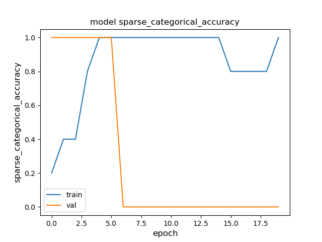

# oscillogram_classification

Neural network based anomaly detection for vehicle components using oscilloscope recordings.

Example of the time series data to be considered (voltage over time).
- 

The task comes down to binary time series classification.

## CNN Architecture

- 

## Positive and Negative Example for each Component

- TODO:
- 

## Training and Validation Loss

- TODO:
- 
