# Oscillogram Classification

Neural network based anomaly detection for vehicle components using oscilloscope recordings.

Example of the time series data to be considered (voltage over time):
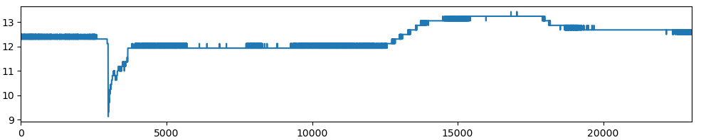

The task comes down to (binary) (univariate) time series classification.

## Classification and Interpretation of Oscillogram Signals
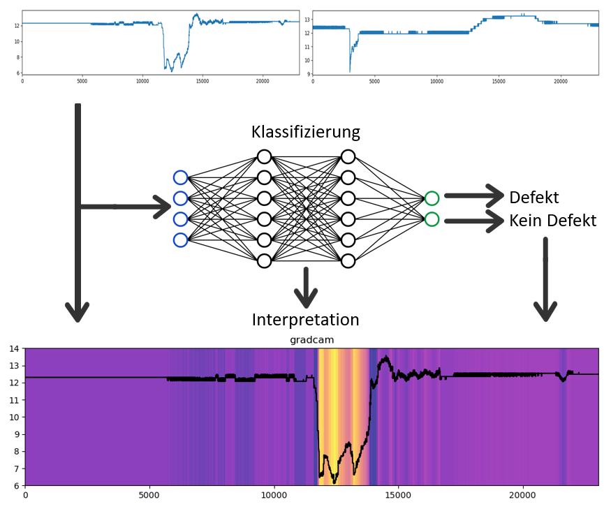

## FCN Architecture
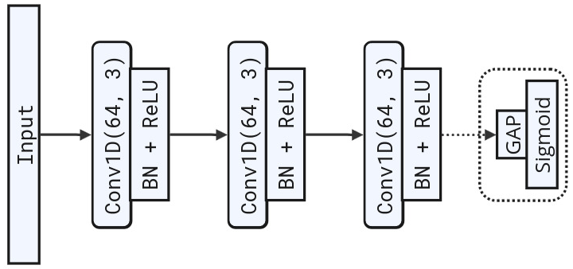

*Note: See ResNet architecture in `img/ResNet.png`*

## Dependencies

- [**matplotlib**](https://matplotlib.org/): library for creating visualizations
- [**numpy**](https://numpy.org/): scientific computing with Python
- [**tensorflow**](https://pypi.org/project/tensorflow/): open source machine learning framework
- [**pandas**](https://pandas.pydata.org/): data analysis and manipulation tool
- [**wandb**](https://pypi.org/project/wandb/): *Weights and Biases* - hyperparameter optimization, i.e., model tuning
- [**tsfresh**](https://github.com/blue-yonder/tsfresh): automatic extraction of relevant features from time series
- [**sklearn**](https://scikit-learn.org/stable/): simple and efficient tools for predictive data analysis
- [**tf_keras_vis**](https://github.com/keisen/tf-keras-vis): neural network visualization toolkit for `tf.keras`

## Installation
```
$ git clone https://github.com/tbohne/oscillogram_classification.git
$ cd oscillogram_classification/
$ pip install .
```

**WandB Setup**
```
$ touch config/api_key.py  # enter: wandb_api_key = "YOUR_KEY"
```

## Config

Hyperparameter configuration in `config/run_config.py`, e.g.:
```python
hyperparameter_config = {
    "batch_size": 32,
    "learning_rate": 0.001,
    "optimizer": "keras.optimizers.Adam",
    "epochs": 100,
    "model": "ResNet"
}
```
WandB sweep config in `config/sweep_config.py`, e.g.:
```python
sweep_config = {
    "batch_size": {
        "values": [4, 16, 32]
    },
    "learning_rate": {
        "values": [0.01, 0.0001]
    },
    "optimizer": {
        "value": "keras.optimizers.Adam"
    },
    "epochs": {
        "values": [10, 30, 50, 100]
    },
    "model": {
        "values": ["FCN", "ResNet"]
    }
}
```

## Choose the model based on the training data

Currently supported models: `FCN`, `ResNet`, `RandomForest`, `MLP`, `DecisionTree`
- If training on feature vectors (non-Euclidean data), e.g. generated by `tsfresh`:
    - `MLP`, `RandomForest`
- If training on (raw) time series (Euclidean data):
    - `FCN`, `ResNet`

## Usage

**Preprocessing**
```
$ python oscillogram_classification/preprocess.py [--znorm] [--diff_format] [--feature_extraction] [--feature_list] --path /DATA --type {training | validation | test}
```
*Note: In the event of `feature_extraction`, in addition to the actual generated records, csv files (e.g. `training_complete_features.csv`) are generated, which contain the list of the features considered in each case.*

**Manual Feature Selection**

When training the model using feature vectors, it is critical that the test, validation, and finally the application data contain the same set of features as those used for training. This can be achieved by manual feature selection, which is shown in the following example:

The training datasets were created with the `--feature_extraction` option, resulting in the following files:
```
training_complete_feature_vectors.npz
training_filtered_feature_vectors.npz
training_complete_features.csv
training_filtered_features.csv
```
Now the model is to be trained using the filtered features. The validation dataset should correspond to this feature selection and thus be generated as follows:
```
$ python oscillogram_classification/preprocess.py --path /VALIDATION_DATA --feature_extraction --feature_list data/training_filtered_features.csv --type validation
```
This in turn leads to a set of files corresponding to the different feature vectors. In the described scenario, the file to be used for training would be `validation_manually_filtered_feature_vectors.npz`. The generation of the test dataset works analogously.

**Training**
```
$ python oscillogram_classification/train.py --train_path TRAIN_DATA.npz --val_path VAL_DATA.npz --test_path TEST_DATA.npz
```
*Note: Before training, a consistency check is performed, which is particularly relevant for training on feature vectors. It is checked whether each of the datasets (train, test, validation) contains exactly the same features in the same order.*

**Class Activation / Saliency Map Generation**
```
$ python oscillogram_classification/cam.py [--znorm] [--diff_format] [--overlay] --method {gradcam | hirescam | tf-keras-gradcam | tf-keras-gradcam++ | tf-keras-scorecam | tf-keras-layercam | tf-keras-smoothgrad | all} --sample_path SAMPLE.csv --model_path MODEL.h5
```
*Note: Using `all` as method results in a side-by-side plot of all methods.*

**WandB Sweeps (Hyperparameter Optimization)**

*"Hyperparameter sweeps provide an organized and efficient way to conduct a battle royale of models and pick the most accurate model. They enable this by automatically searching through combinations of hyperparameter values (e.g. learning rate, batch size, number of hidden layers, optimizer type) to find the most optimal values."* - [wandb.ai](https://wandb.ai/site/articles/introduction-hyperparameter-sweeps)

```
$ python oscillogram_classification/run_sweep.py --train_path TRAIN_DATA.npz --val_path VAL_DATA.npz --test_path TEST_DATA.npz
```

## Positive (1) and Negative (0) Sample for each Component

### Battery (Engine Starting Process)
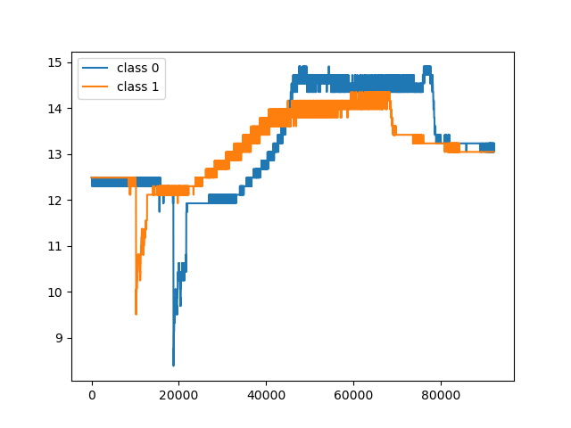

### Air Flow Meter
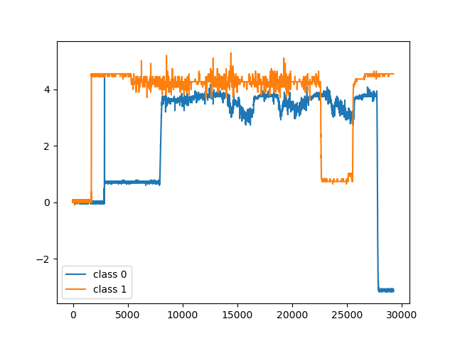

## Training and Validation Accuracy of Selected Models

### FCN demo model - mini-batch (4) gradient descent - one output neuron - synthetic dataset (z-normalized)
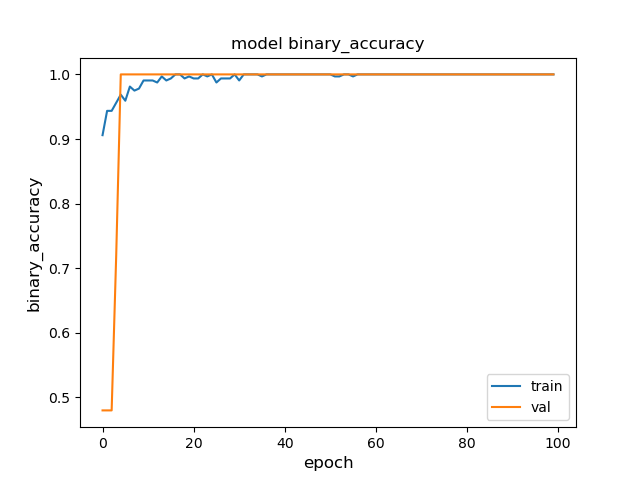

### FCN - mini-batch (8) gradient descent - two output neurons - synthetic dataset (raw)
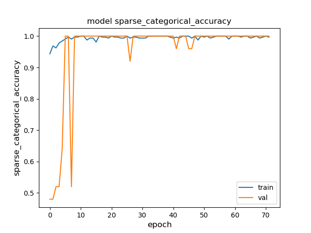

### Grad-CAM Example
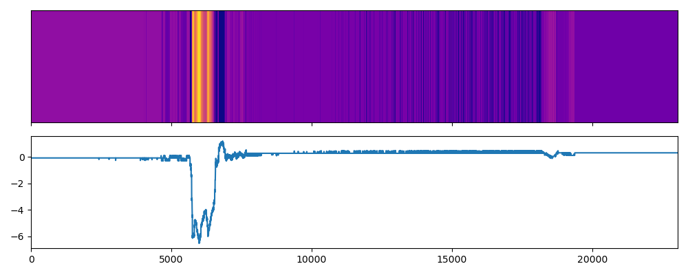

*As overlay*:
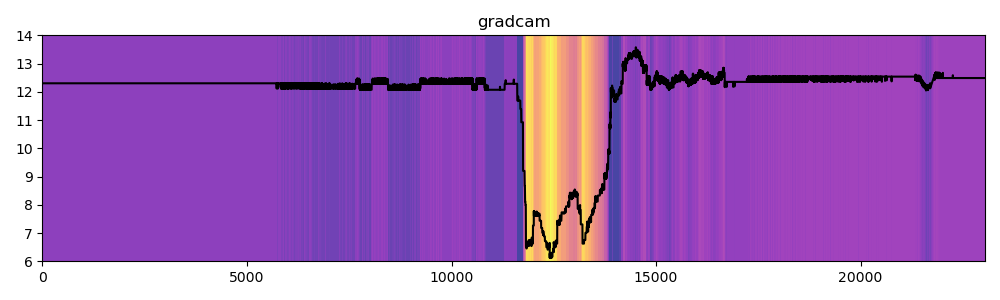

### All CAM Methods Side-by-Side
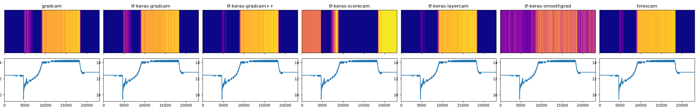

*As overlay*:
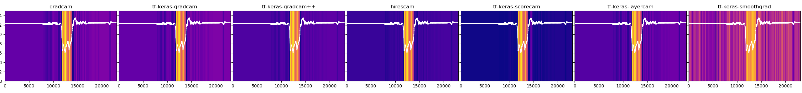

## Labeling Process
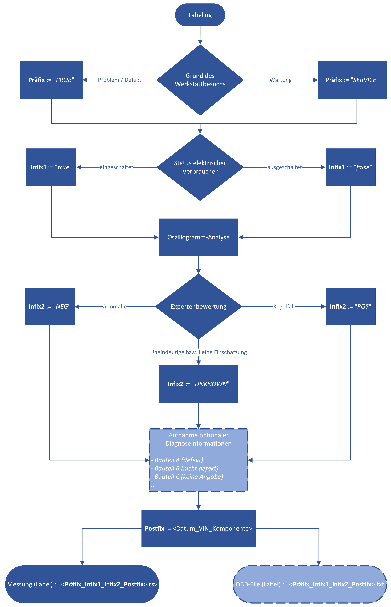
