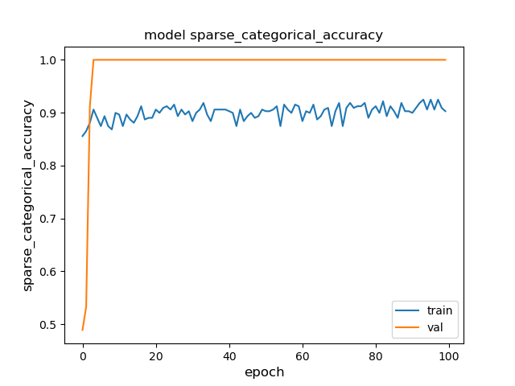
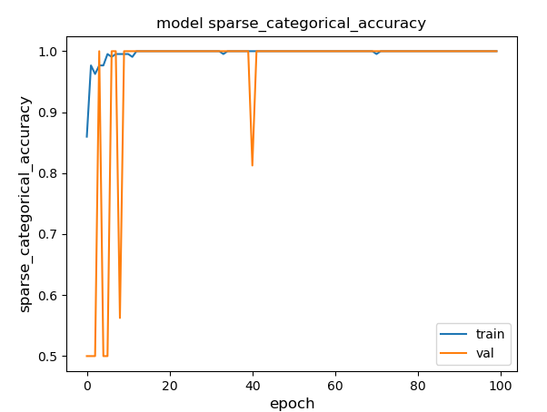

# oscillogram_classification

Neural network based anomaly detection for vehicle components using oscilloscope recordings.

Example of the time series data to be considered (voltage over time).

The task comes down to binary time series classification.

## CNN Architecture

## Positive and Negative Sample for each Component

### Battery:

## Training and Validation Loss

### Mini-Batch Gradient Descent

### Stochastic Gradient Descent

### Grad-CAM Example

