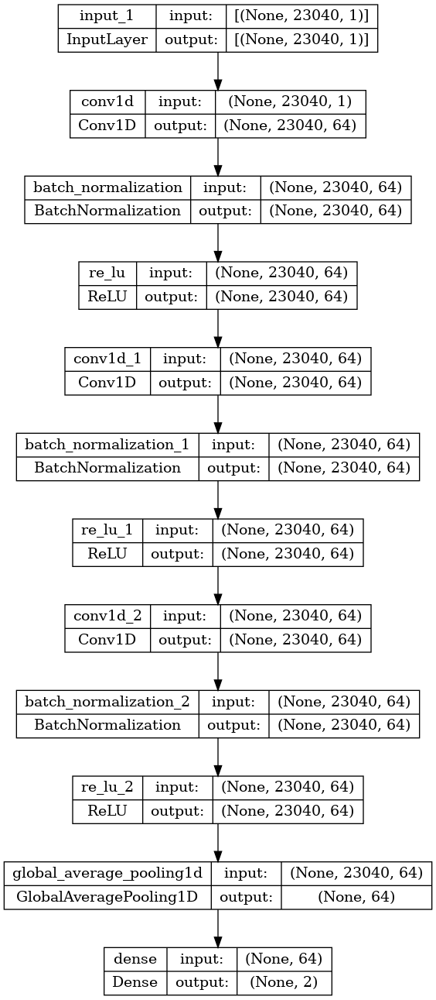

# oscillogram_classification

Neural network based anomaly detection for vehicle components using oscilloscope recordings.

Example of the time series data to be considered (voltage over time).


The task comes down to binary time series classification.

## CNN Architecture


## Dependencies

- [**matplotlib**](https://matplotlib.org/): library for creating visualizations
- [**numpy**](https://numpy.org/): scientific computing with Python
- [**tensorflow**](https://pypi.org/project/tensorflow/): open source machine learning framework
- [**pandas**](https://pandas.pydata.org/): data analysis and manipulation tool

## Usage

**Preprocessing**
```
$ python preprocess.py [--znorm] [--altering_format] --path /TRAINING_DATA --type {training | validation | test}
```
**Training**
```
$ python train.py --train_path TRAIN_DATA.npz --val_path VAL_DATA.npz --test_path TEST_DATA.npz
```
**Class Activation / Saliency Map Generation**
```
$ python cam.py [--znorm] [--altering_format] [--overlay] --method {gradcam | hirescam | tf-keras-gradcam | tf-keras-gradcam++ | tf-keras-scorecam | tf-keras-layercam | tf-keras-smoothgrad | all} --sample_path SAMPLE.csv --model_path MODEL.h5
```
*Note: Using `all` as method results in a side-by-side plot of all methods.*

## Positive and Negative Sample for each Component

### Battery:


## Training and Validation Loss

### Mini-Batch Gradient Descent


### Stochastic Gradient Descent


### Grad-CAM Example


*As overlay*:


### All CAM Methods Side-by-Side


*As overlay*:

