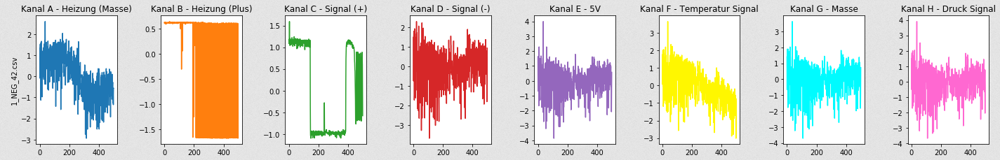
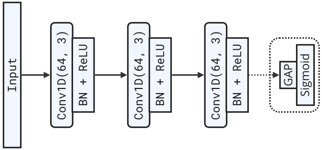

# Oscillogram Classification


[](https://opensource.org/licenses/MIT)

**Neural network based anomaly detection for physical vehicle components using oscilloscope recordings.**

> *Anomalies in the context of this paper refer to specific, known fault cases for which domain experts provide us with datasets to train on. Therefore, it is a matter of recognizing specific faults and not simply deviations from the norm. It is thus binary in the sense that either a specific fault is detected or the signal is classified as regular. Also, the uncertainty allows further conclusions on whether an anomaly is known (high confidence) or unknown (high uncertainty).*

Univariate sample (two classes; positive (1) and negative (0)) of the time series data to be considered (voltage over time - $z$-normalized - in this case, battery voltage during engine starting process):


Multivariate sample: 8 synchronously recorded signals from different vehicle components to be examined in combination (cf. `data/multivariate_real_world/`):


The task comes down to binary (anomaly / regular) univariate / multivariate time series classification, i.e., anomaly detection.

## ANN Architectures

Initially, we trained two self-implemented architectures, the following FCN as well as a ResNet (cf. `img/ResNet.png`):


Additionally, we trained various models from [tsai](https://timeseriesai.github.io/tsai/). The one that was finally used in the multivariate anomaly detection application was an `XCM` (*e<u>X</u>plainable <u>C</u>onvolutional neural network for <u>M</u>ultivariate time series classification*). Two trained versions of it are `experiments/trained_models/druck_combined.pth` and `experiments/trained_models/lambda_combined.pth` (trained on `data/multivariate_real_world/`).

## Dependencies

- for Python requirements, cf. `requirements.txt`
- [**Apache Jena Fuseki**](https://jena.apache.org/documentation/fuseki2/): SPARQL server hosting / maintaining the knowledge graph

## Installation
```
$ git clone https://github.com/tbohne/oscillogram_classification.git
$ cd oscillogram_classification/
$ pip install .
```

## ANN-Based Oscillogram Classification Experiments

The final trained models utilized in the project were all created based on `experiments/oscillogram_classification.ipynb`. The notebook offers functionalities for loading, preprocessing, plotting, training, evaluating and heatmap (saliency map) generation for the considered input oscillograms (univariate and multivariate time series). Currently, we support two self-implemented models: FCN (`keras`) + ResNet (`keras`), and a wide range of `tsai` models, e.g., `XCM`, `XCMPlus` and `TransformerModel`. It is also possible to load and apply an already trained `torch` model, e.g., `experiments/trained_models/lambda_combined.pth`.

## Explicit usage in `vehicle_diag_smach`

Exemplary use of functionalities in [vehicle_diag_smach](https://github.com/tbohne/vehicle_diag_smach) (besides the application of trained models).

### Saliency map generation

```python
# univariate heatmap array generation (various generation methods)
gradcam_arr = cam.tf_keras_gradcam(np.array([net_input]), model, prediction)
gradcam_pp_arr = cam.tf_keras_gradcam_plus_plus(np.array([net_input]), model, prediction)
scorecam_arr = cam.tf_keras_scorecam(np.array([net_input]), model, prediction)
layercam_arr = cam.tf_keras_layercam(np.array([net_input]), model, prediction)

# univariate data - heatmap side-by-side plot (various methods) - time series as overlay
heatmap_img = cam.gen_heatmaps_as_overlay(heatmaps, voltages, title, time_vals)

# multivariate data - heatmap for each channel - side-by-side plot - variable attribution maps
var_attr_heatmap_img = cam.gen_multi_chan_heatmaps_as_overlay(
    var_attr_heatmaps, tensor[0].numpy(), comp_name + res_str, time_vals
)
# multivariate data - heatmap for each channel - side-by-side plot - time attribution maps
time_attr_heatmap_img = cam.gen_multi_chan_heatmaps_as_overlay(
    time_attr_heatmaps, tensor[0].numpy(), comp_name + res_str, time_vals
)
```

### Preprocessing input signals

```python
# multivariate signal (dataframe) for the corresponding .csv file
signal, time_values = preprocess.gen_multivariate_signal_from_csv(csv_path)
# univariate signal for the corresponding .csv file
label, signal, time_values = preprocess.read_oscilloscope_recording(csv_path)

# resample voltage values (time series) to expected length
voltages = preprocess.resample(voltages, model_meta_info["input_length"])
# normalize voltage values (various normalization methods)
voltages = preprocess.z_normalize_time_series(voltages)
voltages = preprocess.min_max_normalize_time_series(voltages)
voltages = preprocess.decimal_scaling_normalize_time_series(voltages, 2)
voltages = preprocess.logarithmic_normalize_time_series(voltages, 10)
```

## ANN-Based Oscillogram Classification

***WandB* Setup**
```
$ touch config/api_key.py  # enter: wandb_api_key = "YOUR_KEY"
```

## Config

Hyperparameter configuration in `config/run_config.py`, e.g.:
```python
hyperparameter_config = {
    "batch_size": 4,
    "learning_rate": 0.001,
    "optimizer": "keras.optimizers.Adam",
    "epochs": 100,
    "model": "FCN",
    "loss_function": "binary_crossentropy",
    "accuracy_metric": "binary_accuracy",
    "trained_model_path": "best_model.h5",
    "save_best_only": True,
    "monitor": "val_loss",
    "ReduceLROnPlateau_factor": 0.5,
    "ReduceLROnPlateau_patience": 20,
    "ReduceLROnPlateau_min_lr": 0.0001,
    "EarlyStopping_patience": 50,
    "validation_split": 0.2
}
```
*WandB* sweep config in `config/sweep_config.py`, e.g.:
```python
sweep_config = {
    "batch_size": {"values": [4, 16, 32]},
    "learning_rate": {"values": [0.01, 0.0001]},
    "optimizer": {"value": "keras.optimizers.Adam"},
    "epochs": {"values": [10, 30, 50, 100]},
    "model": {"values": ["FCN", "ResNet"]}
}
```

## Select the model based on the training data

Currently supported models: `FCN`, `ResNet`, `RandomForest`, `MLP`, `DecisionTree`
- If training on feature vectors (non-Euclidean data), e.g., generated by `tsfresh`:
    - `MLP`, `RandomForest`
- If training on (raw) time series (Euclidean data):
    - `FCN`, `ResNet`

## Usage

### Preprocessing
```
$ python oscillogram_classification/preprocess.py --norm {none | z_norm | min_max_norm | dec_norm | log_norm} [--feature_extraction] [--feature_list] --path /DATA --type {training | validation | test}
```
*Note: In the event of `feature_extraction`, in addition to the actual generated records, csv files (e.g. `training_complete_features.csv`) are generated, which contain the list of the features considered in each case.*

**Manual Feature Selection**

When training the model using feature vectors, it is critical that the test, validation, and finally the application data contain the same set of features as those used for training. This can be achieved by manual feature selection, which is shown in the following example:

The training datasets were created with the `--feature_extraction` option, resulting in the following files:
```
training_complete_feature_vectors.npz
training_filtered_feature_vectors.npz
training_complete_features.csv
training_filtered_features.csv
```
Now the model is to be trained using the filtered features. The validation dataset should correspond to this feature selection and thus be generated as follows:
```
$ python oscillogram_classification/preprocess.py --norm {none | z_norm | min_max_norm | dec_norm | log_norm} --path /VALIDATION_DATA --feature_extraction --feature_list data/training_filtered_features.csv --type validation
```
This in turn leads to a set of files corresponding to the different feature vectors. In the described scenario, the file to be used for training would be `validation_manually_filtered_feature_vectors.npz`. The generation of the test dataset works analogously.

### Training
```
$ python oscillogram_classification/train.py --train_path TRAIN_DATA.npz --val_path VAL_DATA.npz --test_path TEST_DATA.npz
```
*Note: Before training, a consistency check is performed, which is particularly relevant for training on feature vectors. It is checked whether each of the datasets (train, test, validation) contains exactly the same features in the same order.*

### Class Activation / Saliency Map Generation
```
$ python oscillogram_classification/cam.py [--znorm] [--overlay] --method {gradcam | hirescam | tf-keras-gradcam | tf-keras-gradcam++ | tf-keras-scorecam | tf-keras-layercam | tf-keras-smoothgrad | all} --sample_path SAMPLE.csv --model_path MODEL.h5
```
*Note: Using `all` as method results in a side-by-side plot of all methods.*

### HiResCAM Example


### All Heatmap Generation Methods Side-by-Side


## Multivariate Heatmap Examples

### Time Attribution Maps


### Variable Attribution Maps


***WandB* Sweeps (Hyperparameter Optimization)**

*"Hyperparameter sweeps provide an organized and efficient way to conduct a battle royale of models and pick the most accurate model. They enable this by automatically searching through combinations of hyperparameter values (e.g. learning rate, batch size, number of hidden layers, optimizer type) to find the most optimal values."* - [wandb.ai](https://wandb.ai/site/articles/introduction-hyperparameter-sweeps)

```
$ python oscillogram_classification/run_sweep.py --train_path TRAIN_DATA.npz --val_path VAL_DATA.npz --test_path TEST_DATA.npz
```

## Clustering and Sub-ROI Patch Classification

As an alternative to the above classification of entire ROIs (Regions of Interest), we implemented another approach based on the determination of sub-regions, i.e., patches that make up the ROIs. An [ROI detection algorithm](https://github.com/AW40/signal_builder) provides the input for the clustering of the cropped sub-ROIs. The ROIs are divided into the following five categories for the battery signals:


The five categories are practically motivated, based on semantically meaningful regions that a domain expert would look at when searching for anomalies. Afterwards, the patches are clustered and for each patch type, i.e., cluster, a model is trained that classifies samples of the corresponding patch type. The following example shows the result of such a clustering, where each cluster is annotated (red) with the represented patch type from the above battery signal:


In this example, DBA k-means was able to correctly cluster 29/30 patches. The one misclassified patch actually shares many characteristics with the cluster to which it was assigned.

Results of DBA k-means:
```
cluster distribution: [7, 6, 6, 6, 5]
ground truth per cluster: [[1, 3, 1, 1, 1, 1, 1], [4, 4, 4, 4, 4, 4], [2, 2, 2, 2, 2, 2], [5, 5, 5, 5, 5, 5], [3, 3, 3, 3, 3]])
```

**Clustering usage** (with .csv patches):
```
$ python oscillogram_classification/cluster.py --norm {none | z_norm | min_max_norm | dec_norm | log_norm} --path PATH_TO_PATCHES [--clean_patches]
```

## Using Predetermined Clusters for Comparison with Newly Recorded Samples

The idea is to compute the distance between the new time series sample and each of the predetermined cluster centroids. After computing the distances, the cluster with the smallest distance (configurable metric) is selected as the best match for the new sample.

Classify single recording with ground truth label (type: `patch0`):
```
$ python oscillogram_classification/clustering_application.py --samples SAMPLE_patch0.csv
```
Classify set of recordings with ground truth labels (dir of `patch0` type .csv files):
```
$ python oscillogram_classification/clustering_application.py --samples /patch0/
```
Sample output:
```
-------------------------------------------------------------------------
test sample excerpt: [10.129, 10.137, 10.137, 10.153, 10.161, 10.153, 10.153]
best matching cluster for new sample: 0 ( [0, 2, 0, 0, 0, 0, 0] )
ground truth: 0
SUCCESS: ground truth ( 0 ) matches most prominent entry in cluster ( 0 )
-------------------------------------------------------------------------
```
The options without ground truth labels work equivalently, just without the patch type in the file / dir name.

## $k$-NN Classification
```
$ python oscillogram_classification/knn.py --train_path /TRAIN_DATA --test_path /TEST_DATA --norm {none | z_norm | min_max_norm | dec_norm | log_norm}
```

## Training Results of Selected Models

`experiments/trained_models/lambda_combined.pth` (multivariate - 4 channels):
- 
- 
- architecture: `XCM`
- test accuracy: **`0.96`**

`experiments/trained_models/druck_combined.pth` (multivariate - 4 channels):
- 
- 
- architecture: `XCM`
- test accuracy: **`1.0`**

## Cross-Validation Results of Selected Model Architectures

- accuracy of `XCM` on lambda sensor data (multivariate - 4 channels): **`0.9826`**
- accuracy of `TransformerModel` on lambda sensor data (multivariate - 4 channels): **`0.9235`**
- accuracy of `XCM` on intake manifold pressure sensor data (multivariate - 4 channels): **`1.0`**

## Related Publications

```bibtex
@inproceedings{10.1145/3587259.3627546,
    author = {Bohne, Tim and Windler, Anne-Kathrin Patricia and Atzmueller, Martin},
    title = {A Neuro-Symbolic Approach for Anomaly Detection and Complex Fault Diagnosis Exemplified in the Automotive Domain},
    year = {2023},
    isbn = {9798400701412},
    publisher = {Association for Computing Machinery},
    address = {New York, NY, USA},
    url = {https://doi.org/10.1145/3587259.3627546},
    doi = {10.1145/3587259.3627546},
    booktitle = {Proceedings of the 12th Knowledge Capture Conference 2023},
    pages = {35–43},
    numpages = {9},
    location = {Pensacola, FL, USA},
    series = {K-CAP '23}
}
```
